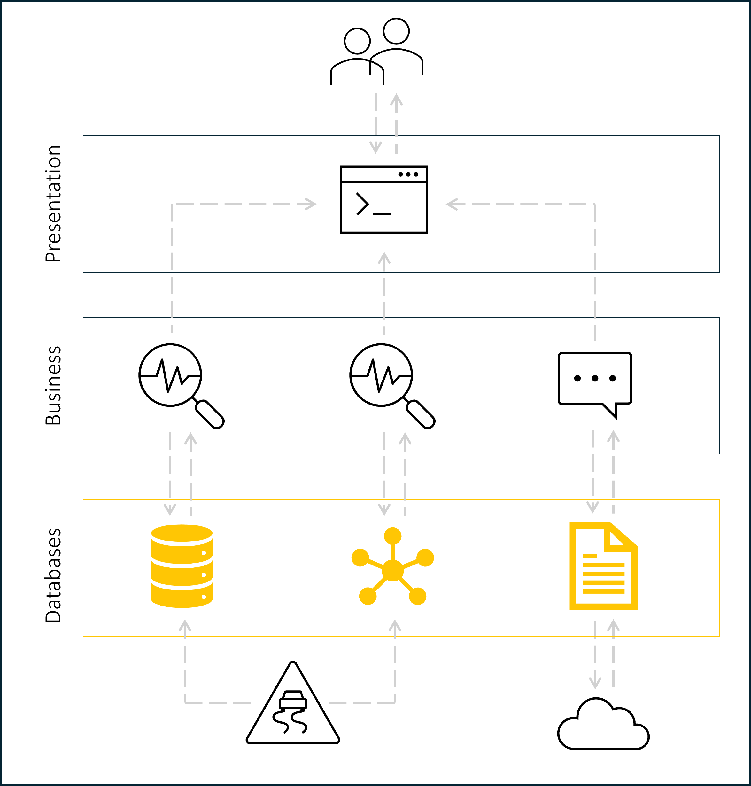

# DB-Exam
Created by the group Pejomi (Peter, Jonas, Mie)

## About the project
This project is a database exam project for the course "Databases" at the Cphbusiness Lyngby campus. Below you will find a description of the project, the database design, and the deployment.

## Business scenario 
**SafeWay**  is a company working with artificial intelligence and machine learning to provide tools for investigating and predicting car accidents.

Their service is based on a large dataset of car accidents in the UK, which includes information about the weather, road conditions, time of day, the driver involved and other factors leading up to the accident.

With the data they want to provide a services such as a chatbot that can answer questions about car accidents, a machine learning model that can predict the likelihood of a car accident given certain conditions, and a simulation environment for training autonomous cars.

## Application domain
For the current domain of the application the focus has been limitid to concentrate on managing data for storing in databases. 

### Users
The application are meant for two types of users:
- **Admins**: Admins can access all chat history and the traffic accident data set.

- **Users**: Users can access their own chat history and search in the traffic accident data set.

### Functionalities
For the chatbot service, the following functionalities are required:

**Functional requirements:**
- **Chat history**: The chat history should be stored in a database.
- **Search**: The user should be able to search in the traffic accident data set.
- **Search criteria**: The user should be able to search with a large amount of criteria in the traffic accident data set.
- **Data set**: The traffic accident data set should be stored in a database.

**Non-functional requirements:**
- **Performance**: The application should be able to handle a large amount of users and data.
- **User-friendly**: The app should be user-friendly and easy to use.

--- 

Below is a diagram of the overall architecture of the application:



## Database Design
For the database design, we have chosen to implement three different types of databases: 

- Document
- Relational 
- Graph database

### Document database
The document database is implemented using MongoDB. The database is designed to store the chat history for the chatbot service. 

The database "chatbot" consists of a collection called "messages". The collection stores the chat history between the user and the chatbot. Below is an example of a document in the "messages" collection.


```json
{
    "email": "alice@gmail.com",
    "title": "Car accident",
    "message": [
        {
            "role": "user",
            "content": "What should I do if I'm in a car accident?"
        },
        {
            "role": "chatbot",
            "content": "You should call the police and your insurance company"
        }
    ]
}
```
Our database is deployed on MongoDB Atlas with a cluster in the cloud in which consists of 3 replica sets.

### Relational database
The relational database is implemented using MSSQL. The database is designed to store the traffic accident data set.

Below is a diagram of the relational database design:


### Graph database
The graph database is implemented using Neo4j. The database is designed to store the relationships between the different entities in the traffic accident data set.

## Traffic accident in UK data set
The data set contains information about car accidents in the UK. The data set is used to populate the relational database and the graph database.

[Link to the data set](https://www.kaggle.com/datasets/tsiaras/uk-road-safety-accidents-and-vehicles?select=Accident_Information.csv)

## Current status
The focus has been on the database design and the implementation of the three database types: Document, Relational and Graph database. 

The streamlit app contains a simple user interface where the user can search in the traffic accident data set. The user can search with a large amount of criteria such as the weather, road conditions, time of day, and the driver involved. 


The user can also access their own chat history with the chatbot and admin can access all chat history.


Some features such as proper response from chatbot and machine learning model are not implemented yet. These features will be implemented in the future.

## Run streamlit app
To run the streamlit app, you need to have streamlit installed. If you don't have streamlit installed, you can install it by running the following command:

```pip install streamlit```

After installing streamlit, you can run the streamlit app by running the following commands:

```cd streamlit_app ```

```streamlit run app.py```

## Technologies
The following technologies have been used in the project:
- MongoDB
- MSSQL
- Neo4j
- Streamlit
- Python
