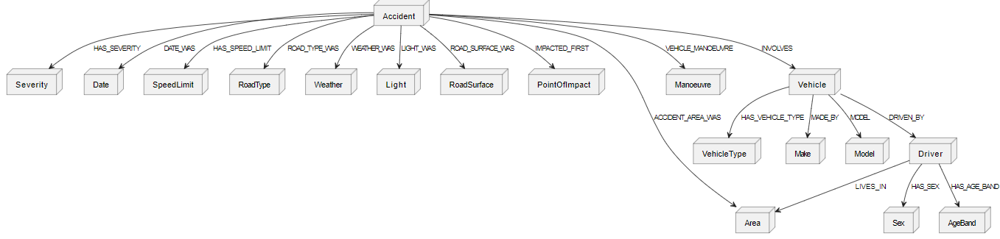
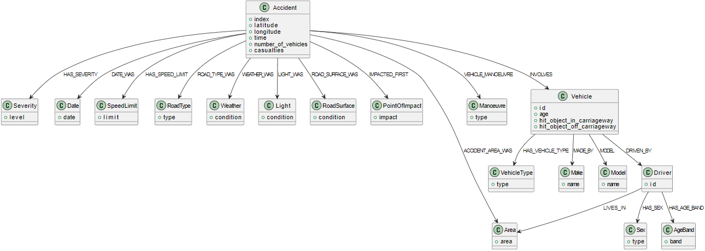

# All Nodes and relationships in the database

```
[Accident] --HAS_SEVERITY--> [Severity]
[Accident] --DATE_WAS--> [Date]
[Accident] --HAS_SPEED_LIMIT--> [SpeedLimit]
[Accident] --ROAD_TYPE_WAS--> [RoadType]
[Accident] --WEATHER_WAS--> [Weather]
[Accident] --LIGHT_WAS--> [Light]
[Accident] --ROAD_SURFACE_WAS--> [RoadSurface]
[Accident] --IMPACTED_FIRST--> [PointOfImpact]
[Accident] --ACCIDENT_AREA_WAS--> [Area]
[Accident] --VEHICLE_MANOEUVRE--> [Manoeuvre]
[Accident] --INVOLVES--> [Vehicle]
[Vehicle] --HAS_VEHICLE_TYPE--> [VehicleType]
[Vehicle] --MADE_BY--> [Make]
[Vehicle] --MODEL--> [Model]
[Vehicle] --DRIVEN_BY--> [Driver]
[Driver] --HAS_SEX--> [Sex]
[Driver] --HAS_AGE_BAND--> [AgeBand]
[Driver] --LIVES_IN--> [Area]
```

## Nodes & Relationships


## Nodes & Relationships with properties



## Indexes
Indexing is important in databases, including graph databases like Neo4j, because it improves query performance by allowing the database to quickly locate the rows or nodes that match certain criteria. Here are the ones we have created for our database:
```
            # Accident node
            "CREATE CONSTRAINT FOR (accident:Accident) REQUIRE accident.index IS UNIQUE",
            "CREATE INDEX FOR (accident:Accident) ON (accident.latitude)",
            "CREATE INDEX FOR (accident:Accident) ON (accident.longitude)",
            "CREATE INDEX FOR (accident:Accident) ON (accident.time)",

            # Severity node
            "CREATE INDEX FOR (severity:Severity) ON (severity.level)",

            # Date node
            "CREATE INDEX FOR (date:Date) ON (date.date)",

            # SpeedLimit node
            "CREATE INDEX FOR (speedLimit:SpeedLimit) ON (speedLimit.limit)",

            # RoadType node
            "CREATE INDEX FOR (roadType:RoadType) ON (roadType.type)",

            # Weather node
            "CREATE INDEX FOR (weather:Weather) ON (weather.condition)",

            # Light node
            "CREATE INDEX FOR (light:Light) ON (light.condition)",

            # RoadSurface node
            "CREATE INDEX FOR (roadSurface:RoadSurface) ON (roadSurface.condition)",

            # PointOfImpact node
            "CREATE INDEX FOR (pointOfImpact:PointOfImpact) ON (pointOfImpact.impact)",

            # Area node
            "CREATE INDEX FOR (area:Area) ON (area.area)",

            # Manoeuvre node
            "CREATE INDEX FOR (manoeuvre:Manoeuvre) ON (manoeuvre.type)",

            # Vehicle node
            "CREATE CONSTRAINT FOR (vehicle:Vehicle) REQUIRE vehicle.id IS UNIQUE",
            "CREATE INDEX FOR (vehicle:Vehicle) ON (vehicle.age)",
            "CREATE INDEX FOR (vehicle:Vehicle) ON (vehicle.hit_object_in_carriageway)",
            "CREATE INDEX FOR (vehicle:Vehicle) ON (vehicle.hit_object_off_carriageway)",

            # VehicleType node
            "CREATE INDEX FOR (vehicleType:VehicleType) ON (vehicleType.type)",

            # Make node
            "CREATE INDEX FOR (make:Make) ON (make.name)",

            # Model node
            "CREATE INDEX FOR (model:Model) ON (model.name)",

            # Driver node
            "CREATE CONSTRAINT FOR (driver:Driver) REQUIRE driver.id IS UNIQUE",

            # Sex node
            "CREATE INDEX FOR (sex:Sex) ON (sex.type)",

            # AgeBand node
            "CREATE INDEX FOR (ageBand:AgeBand) ON (ageBand.band)"
```